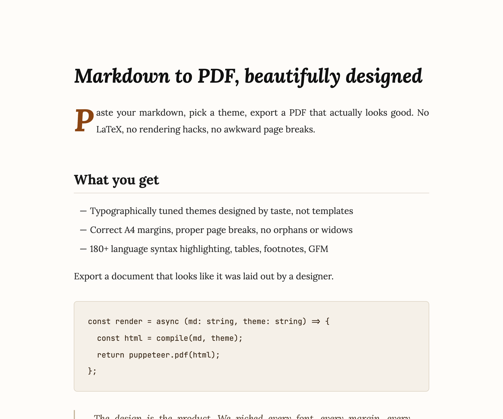
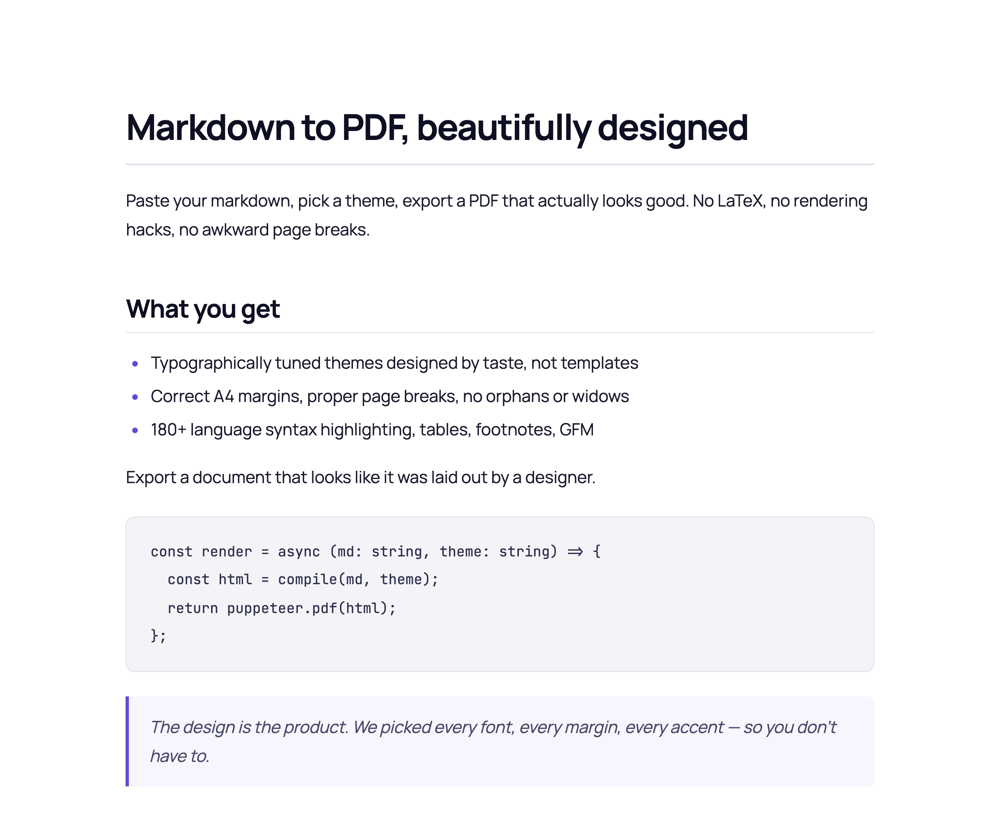
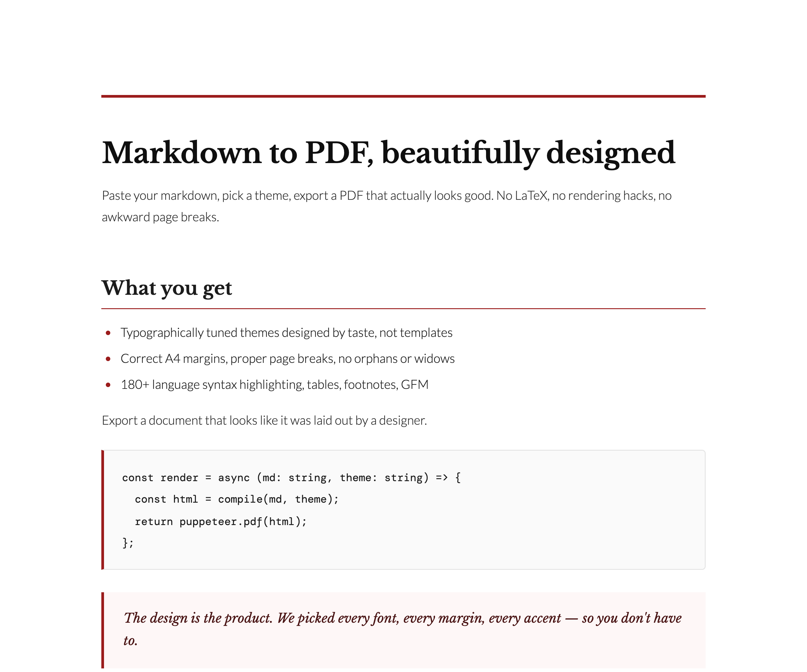
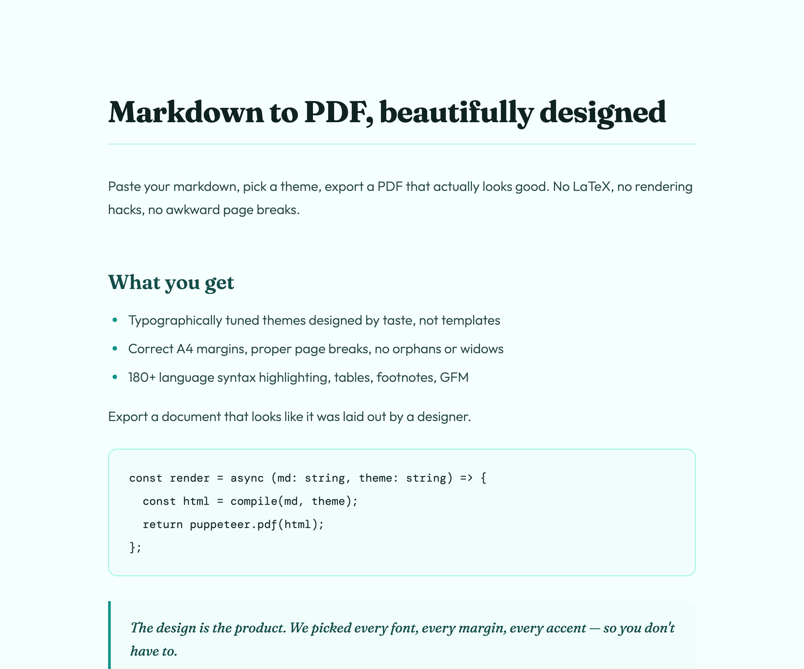
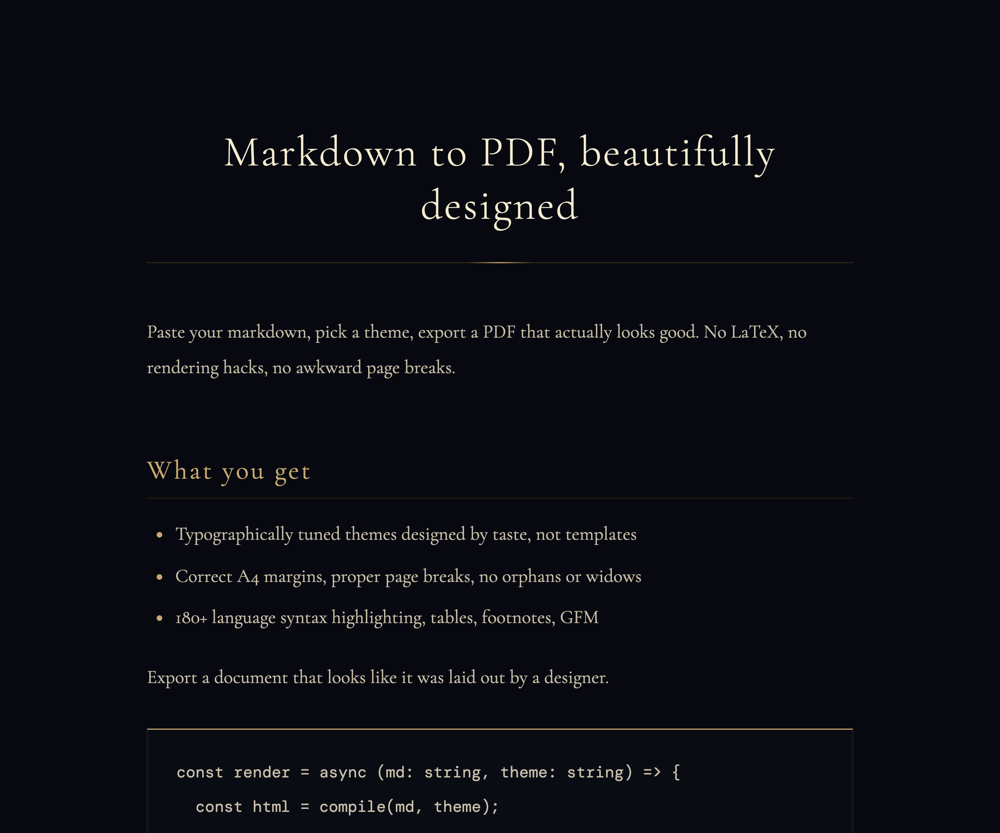
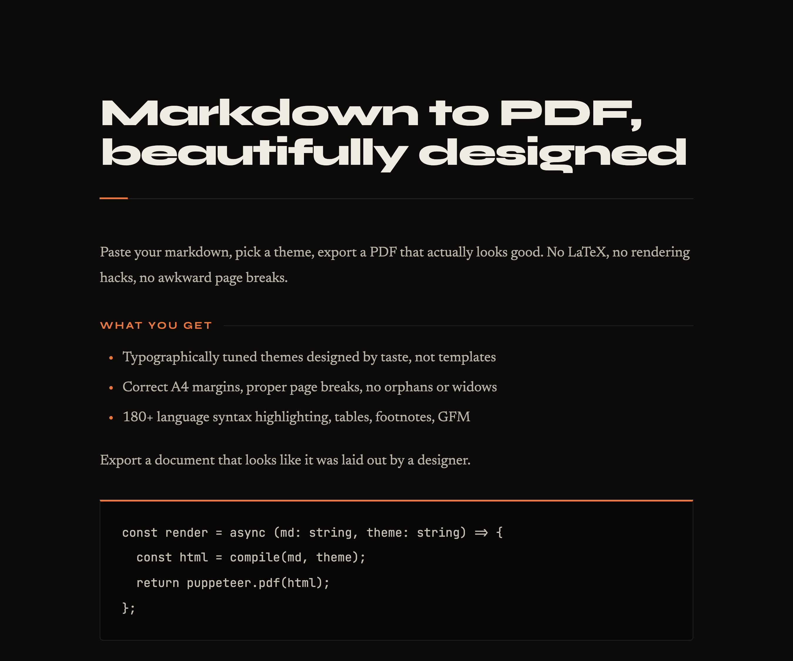

# MarkPDF — Claude Skill

> Convert Markdown to **premium-themed PDFs**, slide decks (PPTX or PDF), styled HTML, and shareable links — all from a single skill in Claude.

This is the official Claude Skill for [MarkPDF](https://markpdf.app). It teaches your AI agent the opinionated workflow for turning Markdown into production-grade documents via the MarkPDF MCP server.

## Install

One command, in any agent that supports the [Agent Skills standard](https://agentskills.io):

```bash
npx skills add gausoft/markpdf-skill -a claude-code
```

Replace `claude-code` with your agent (`cursor`, `vscode`, `copilot`, etc.). See [skills.sh](https://skills.sh) for the full list.

## Prerequisites

The skill drives the **MarkPDF MCP server**. You need it configured before the skill can produce anything. Setup snippets for Claude Code, Cursor, and others:

👉 **<https://markpdf.app/integrations/mcp>**

No signup needed for a trial token — `whoami` accepts a free token and grants 2 exports/day. Pro keys (LTD $19) unlock unlimited exports + 13 themes + custom fonts.

## What this skill does

| When you ask… | Claude will… |
|---|---|
| "Make a PDF from this markdown" | Pick the right theme, render, generate a clean share link, deliver both |
| "Turn this into a pitch deck" | Use Marp slides + the `aurora` theme, return PDF or PPTX |
| "Share this with alice@example.com" | Email-gate the share link with magic-link auth |
| "Style it like a McKinsey report" | Pro theme `consul` (or fall back to `paper` on free tier) |
| "Use my brand color #ff5722" | Customize accent through `customizations.accent` |
| "Just give me the file" | Skip the share link, surface the direct download |

The skill bundles **8 reference recipes** (academic paper, pitch deck, executive report, password-protected share, custom CSS, etc.) and **OS-aware auto-open** so the result lands directly in your browser.

## The 7 MCP tools

| Tool | Purpose | Quota |
|---|---|---|
| `whoami` | Tier + remaining quota | Free |
| `list_themes` | Browse all available themes | Free |
| `redeem_license` | Upgrade a free token to Pro in-place | Free |
| `convert_markdown_to_html` | Iterate styling without burning quota | Free |
| `convert_markdown_to_pdf` | Final document export | Counts toward daily quota |
| `convert_markdown_to_slides` | Slide deck (PDF or PPTX) | Counts toward daily quota |
| `create_share_link` | Default delivery channel — clean `markpdf.app/d/…` URL | Free |

## Themes — gallery

A taste of what the skill produces. **Free** themes work with any token; **Pro** unlock with a license key (LTD $19).

<table>
  <tr>
    <td align="center" width="33%">
      <br>
      <b>Paper</b> · <sub>Free</sub><br>
      <sub>Editorial longform · Lora</sub>
    </td>
    <td align="center" width="33%">
      <br>
      <b>Slate</b> · <sub>Free</sub><br>
      <sub>Linear/Notion clean · Inter</sub>
    </td>
    <td align="center" width="33%">
      <br>
      <b>Consul</b> · <sub>Pro</sub><br>
      <sub>Corporate / consulting</sub>
    </td>
  </tr>
  <tr>
    <td align="center" width="33%">
      <br>
      <b>Aurora</b> · <sub>Pro</sub><br>
      <sub>Startup pitch · vibrant</sub>
    </td>
    <td align="center" width="33%">
      <br>
      <b>Obsidian</b> · <sub>Pro</sub><br>
      <sub>Luxury / premium dark</sub>
    </td>
    <td align="center" width="33%">
      <br>
      <b>Midnight</b> · <sub>Pro</sub><br>
      <sub>Dark mode tech / dev</sub>
    </td>
  </tr>
</table>

Plus `ivory`, `dusk`, `executive`, `prose`, `folio`, `scholar`, `academic`, `hertz`, `quill`, `rosepine`, `horizon` and more. See the [full catalog](https://markpdf.app/themes) or run `list_themes` from inside Claude.

## Bundle structure

```
markpdf-skill/
├── SKILL.md              # Manifest + golden rules + variation playbook
├── references/           # On-demand docs (workflows, themes, slides, customization, frontmatter)
├── examples/             # Ready-to-render samples (academic, pitch-deck, report)
├── scripts/              # render.sh (curl fallback) + open-url.sh (OS-aware)
└── previews/             # Theme gallery PNGs (rendered from a deterministic sample)
```

## Updating

The skill is auto-synced from the [MarkPDF monorepo](https://markpdf.app). Pull the latest with:

```bash
npx skills add gausoft/markpdf-skill -a claude-code --force
```

## License

[MIT](./LICENSE) — copyright © Gauthier Eholoum.

## Links

- 🌐 Web app: <https://markpdf.app>
- 📚 MCP setup: <https://markpdf.app/integrations/mcp>
- 🎨 Themes: <https://markpdf.app/themes>
- ⭐ Skill listing: <https://skills.sh>
