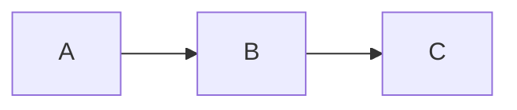

# Slides Reference (Marp-compatible)

MarkPDF slides use **Marp** syntax. If you know Marp, you know MarkPDF slides.

## Anatomy of a deck

```markdown
---
marp: true
theme: aurora        # any slide theme slug
size: 16:9           # or 4:3
paginate: true       # show slide numbers
title: Q4 Roadmap    # PPTX title (also used as filename)
author: Acme Inc.
---

# Title slide
A subtitle in plain text

---

## Second slide
- Bullet
- Another bullet

---

<!-- _class: lead -->
## A "lead" slide (vertically centered)
```

**Slide separator: `---` on its own line.**

## Frontmatter directives

| Key | Values | Default |
|---|---|---|
| `marp` | `true` | required |
| `theme` | slide theme slug | `slate` |
| `size` | `16:9` \| `4:3` | `16:9` |
| `paginate` | `true` \| `false` | `true` |
| `title`, `author`, `subject` | strings | — (used in PPTX core props) |

You can also pass `slideTheme`, `ratio`, `paginate` directly to the MCP tool to override frontmatter.

## Per-slide directives

HTML comments scoped to the next slide use `_` prefix:

```markdown
<!-- _class: lead -->          # apply CSS class to THIS slide only
<!-- _backgroundColor: #000 -->
<!-- _color: white -->
```

Without underscore, the directive applies from that slide onward:

```markdown
<!-- class: invert -->         # all subsequent slides get .invert
```

## Common slide layouts (works in `slate`, others may vary)

### Title slide
```markdown
<!-- _class: title -->
# Product launch
A new way to ship faster
```

### Split (2 columns)
```markdown
<!-- _class: split -->
## Why now
Markets shifted in Q3.


```

### Quote slide
```markdown
<!-- _class: quote -->
> "Make something people want."
— Paul Graham
```

### Stats slide (huge number + caption)
```markdown
<!-- _class: stats -->
# 312%
Growth in active users since January
```

### Code-focused slide
```markdown
<!-- _class: code-focus -->
```ts
const greet = (name: string) => `Hello ${name}`;
```
```

### Full-bleed image background
```markdown
<!-- _class: image-bg -->
<!-- _backgroundImage: url('https://…/hero.jpg') -->
# Headline over photo
```

## Authoring rules of thumb

1. **One idea per slide.** If a slide needs a scrollbar, split it.
2. **Headings drive size** — `#` is huge, `##` is the workhorse, `###` for sub-points.
3. **Bullet lists max 5 items.** Past that, switch to a 2-column split.
4. **Code blocks: keep ≤ 12 lines.** Use `_class: code-focus` for hero code.
5. **Images: prefer `https://` URLs** over base64 (keeps Markdown light).
6. **Tables work but stay small** — 3 columns × 5 rows max, or use a chart image.

## PDF vs PPTX output

| Aspect | `format: "pdf"` | `format: "pptx"` |
|---|---|---|
| File type | Vector PDF | Editable PowerPoint |
| Visual fidelity | Pixel-perfect | Slides become 2× screenshots inside PPTX |
| Editable text in PPT | No | No (rendered as images) |
| Best for | Sharing, printing | Handoff to a client who must "edit" it |
| File size | Small | Larger (raster) |

**Default to `pdf`** unless the user explicitly says "PowerPoint" or needs `.pptx`.

## Calling the MCP tool

```jsonc
{
  "tool": "convert_markdown_to_slides",
  "input": {
    "markdown": "<full deck markdown>",
    "format": "pdf",
    "slideTheme": "aurora",       // overrides frontmatter
    "ratio": "16:9",
    "paginate": true,
    "pptxMetadata": {              // ignored if format=pdf
      "title": "Q4 Roadmap",
      "author": "Acme Inc."
    }
  }
}
```

## KaTeX & Mermaid

Both are supported in slides:

```markdown
$$ E = mc^2 $$


```

## Common errors

| Error | Cause | Fix |
|---|---|---|
| `NoSlidesError` | No `---` separators found | Add slide breaks |
| `unknown_slide_theme` | Typo | Auto-falls back to `slate`; check the warning |
| Theme looks wrong (small headings) | You wrote raw `h1 { ... }` in `overrideCSS` | Marp specificity wins; prefix with `section ` |
